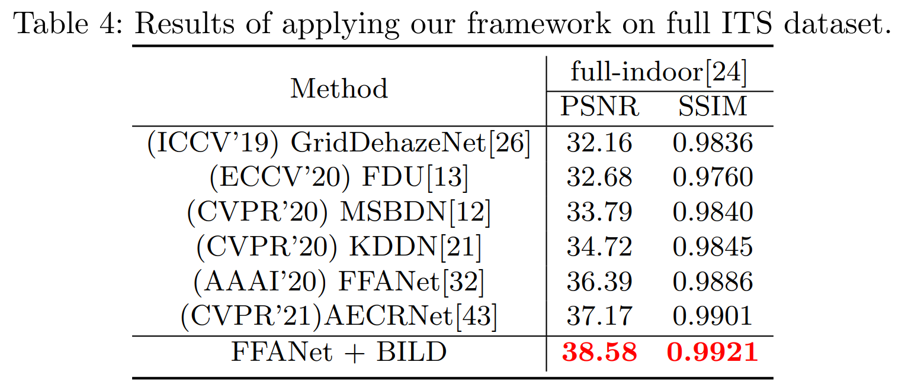

##  [Boosting Supervised Dehazing Methods via Bi-level Patch Reweighting] (ECCV 2022)
 Official implementation.

---

### Dependencies and Installation

* matplotlib==3.4.2
* numpy==1.19.2
* Pillow==8.4.0
* scikit_image==0.17.2
* skimage==0.0
* torch==1.7.1
* torchvision==0.8.2

### Datasets Preparation
synthetic dataset  -- RESIDE: ITS, OTS, SOTS
Dataset website:[RESIDE](https://sites.google.com/view/reside-dehaze-datasets/)

real-world dataset -- O-HAZE and NH-HAZE
Dataset website:[O-HAZE](https://data.vision.ee.ethz.ch/cvl/ntire18/o-haze/)
				[NH-HAZE](https://data.vision.ee.ethz.ch/cvl/ntire20/nh-haze/)

### Performance

 

### Usage

#### Test
Here, we adopt FFANet and BILD for example and you can replace your own model with `code/FFA/`.
Trained_models are available at `trained_models/`

Main function is at train.py. The train() function is for model training and the test() function is for model testing.
Before training or testing, make sure the file path corresponds to yours.

#### Performance on out_of_distribution dataset

 

